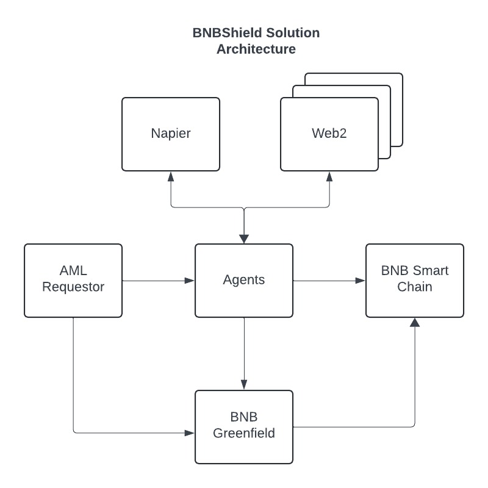

### BNBShield: Anti Money Laundering - PEP Attestation System

#### Introduction

BNBShield is a trustless enterprise dapp designed to manage multi‑party attestation of AML records (specifically PEP checks) on the BNB Smart Chain (BSC).
The system leverages EIP‑712 compliant signatures so that both the record submitter and an attesting agent can confirm off‑chain data before the record is finalized on‑chain.

### Overview (see BNB-Shield-Design.pdf for expanded details)




The project consists of two main components:
- Smart Contract (Solidity):
  - AttestationContract
    - Minting: A new record is minted with a pointer (e.g. BNB Greenfield URI) in a Pending state.
    - Attestation: Off‑chain signatures from both the submitter and the agent (attestor) are verified on‑chain using EIP‑712. Only if both signatures are valid, the record’s status is updated to Attested.
    - Finalization: A trusted authority (the contract owner) can finalize the record by marking the outcome as Reward (positive) or Slash (negative).
  - Agent Client Code:
    - Implements integration with the smart contract using web3.py.
    - Provides helper functions:
      - mint_pep: Calls mintPEPRecord to create a new record.
      - sign_attestation: Constructs an EIP‑712 compliant digest and signs it using a provided private key.
      - attest_contract: Uses the signatures from both parties to call attestRecord on the contract.

### Features

- EIP‑712 Compliant Attestation: Secure off‑chain signing of structured data.
- Multi‑Party Attestation: Both the record submitter and an agent (or shield) must sign the payload.
- State Management: Smart contract state transitions from Pending → Attested → Finalized (Reward/Slash).
- Web3.py Integration: Python scripts for minting records and submitting attestations to the blockchain.

### Prerequisites
- Node & Network:
- BNB Smart Chain (BSC) or compatible Ethereum network.
- BSC node endpoint (e.g., via Infura or a local node).
- Python 3.8+ (minimum recommended Python 3.10).

### Environment Variables:
Create a .env file in the project root with the following keys:

```
PEP_CONTRACT_ADDRESS=0x227e0B523f97A51A0F0957b4Eeee5cba5d6dfAa1
BSC_WEB3_URL=https://bsc-mainnet.infura.io/v3/your-infura-project-id
SUBMITTER_PRIVATE_KEY=0x
AGENT_PRIVATE_KEY=0x
```

### Usage

Running the Client

To mint a record and attest it, run the main script (for example, agent.py or web3_client.py):

```bash
python agent_executor.py
```

The script will:
	•	Mint a new PEP record using mint_pep
	•	Sign the attestation payload with EIP‑712 via sign_attestation
	•	Call attestRecord to attest the record on‑chain

Check the printed transaction hashes (which include BscScan links) for details.

### Troubleshooting
- Invalid EIP‑712 Signature:
  - Ensure that the type string used for signing exactly matches the one used in your Solidity contract. For instance, if your contract’s type hash is computed from "PEPAttestation(uint256 id,address submitter,address agent,bytes32 pointer,uint256 nonce)", your client must use the same string.
- Transaction Failures:
  - Verify that the nonce and gas settings are correctly configured and that your wallet has sufficient funds on BSC.
